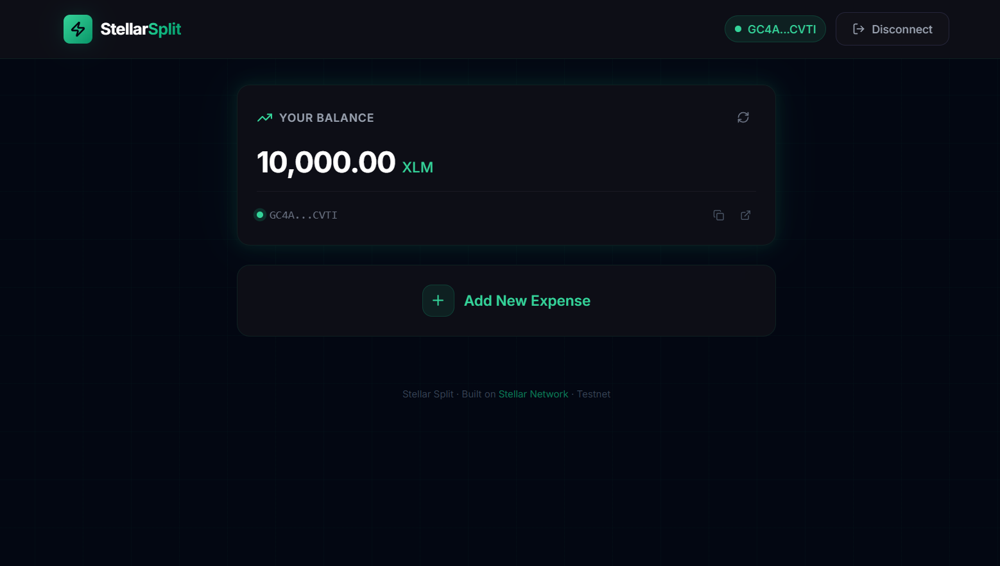

# ⚡ StellarSplit

**StellarSplit** is a decentralized expense-splitting application built natively on the Stellar blockchain. It allows users to collectively track shared bills and seamlessly settle debts peer-to-peer using XLM, removing any need for bank intermediaries or delayed fiat transfers.

🔗 **Live Application:** [SplitSphere on Vercel](https://split-sphere-f2k6.vercel.app/)

---

## 🏗 System Design & Architecture

StellarSplit follows a sleek, single-page application (SPA) architecture combined with a purely decentralized on-chain settlement mechanism.

### Technology Stack
- **Frontend Framework:** React (Vite)
- **Styling & UI:** Tailwind CSS v4 alongside Framer Motion for high-fidelity animations, a glassmorphic aesthetic, and a fully responsive grid.
- **Blockchain Connectivity:** 
  - `@stellar/freighter-api`: Handles secure authentication and prompt-based transaction signing.
  - `@stellar/stellar-sdk`: Utilized for network communication, parsing Stellar Public Keys, building XDR transaction envelopes, and querying the Testnet Horizon server API.
- **Data Architecture (Phase 1):** The current iteration utilizes normalized internal `localStorage` to retain the localized state of unsettled expenses until Soroban smart contracts manage the state mapping.
- **Hosting / Deployments:** Deployed on Vercel.

---

## ⚪️ Level 1 - White Belt Progress

This project satisfies the requirements for the **Level 1 - White Belt** Stellar dApp progression, focusing heavily on wallet connectivity, reading on-chain XLM balances, and executing direct raw transactions using the Stellar Testnet.

### 1. Wallet Setup & Connection
Full integration with Freighter Wallet on the Stellar Testnet. The dApp securely facilitates the handshake and seamlessly handles user disconnection and session continuity.

> **Wallet Connected State:**
>
> 

### 2. Balance Handling
Instantly hits the Horizon Testnet upon connection to scrape the current account state and displays the live XLM balance clearly within the main dashboard.

> **Balance Displayed:**
>
> 

### 3. Transaction Flow & User Feedback
Users can add an expense split math dynamically. Clicking "Pay" initiates a direct payment through the `@stellar/stellar-sdk`.
- We successfully build a payment transaction via the Freighter interface.
- Toast notifications and UI logic act instantly upon `.sendPayment()` promise resolution.
- It displays the successful block completion, complete with a direct outbound link referencing that specific transaction hash on Stellar Expert.

*(Additional screenshots for transaction success prompts will be added during final testing.)*

---

## 🚀 Setup Instructions (Local Development)

To run StellarSplit on your local machine:

1. **Clone the repository:**
   ```bash
   git clone https://github.com/soumyaditya-7/SplitSphere.git
   cd SplitSphere
   ```

2. **Install dependencies:**
   Make sure you have Node installed, then run:
   ```bash
   npm install
   ```

3. **Start the development server:**
   ```bash
   npm run dev
   ```

4. **Testing the dApp:**
   - Open `http://localhost:5173/` in your browser.
   - Ensure you have the [Freighter Browser Extension](https://www.freighter.app/) installed.
   - Switch your Freighter network to **Testnet** and ensure you have testnet XLM funded (you can fund easily via the internal Freighter testnet faucet tool).

---

> Built with ⚡ by Soumyaditya
