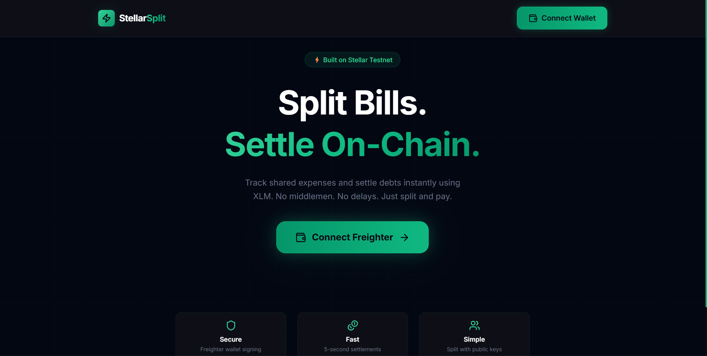
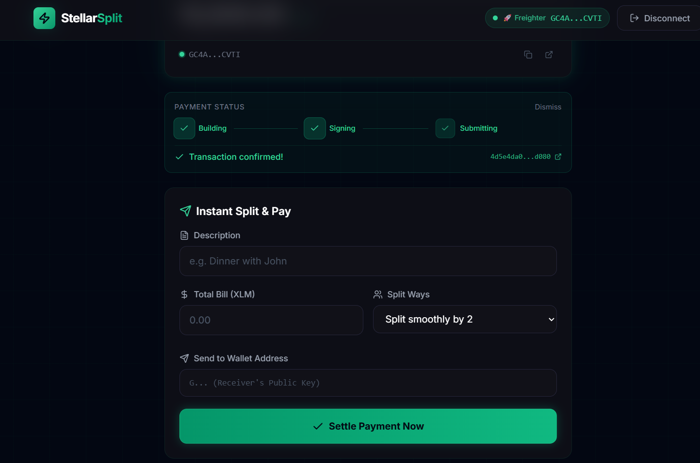
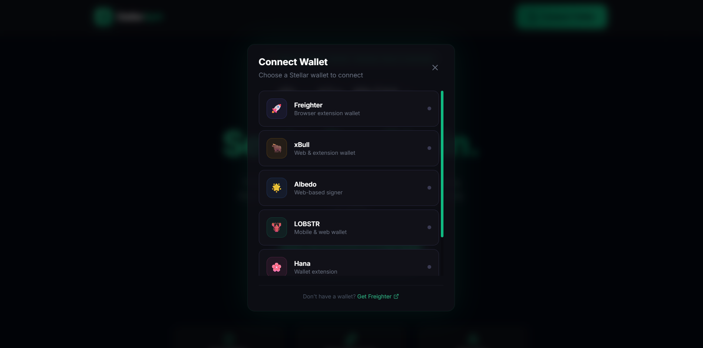

# ⚡ SplitSphere

**SplitSphere** is a decentralized **Instant Split & Pay** application built natively on the Stellar blockchain. It allows users to calculate their share of a shared bill and instantly settle it peer-to-peer on-chain using XLM — no banks, no delays, no intermediaries.

🔗 **Live Application:** [SplitSphere on Vercel](https://split-sphere-f2k6.vercel.app/)  
📂 **GitHub Repository:** [github.com/soumyaditya-7/SplitSphere](https://github.com/soumyaditya-7/SplitSphere)

---

## 🏗 System Design & Architecture

SplitSphere follows a single-page application (SPA) architecture combined with a purely decentralized on-chain settlement mechanism via Soroban smart contracts on the Stellar Testnet.

### Technology Stack

| Layer | Technology |
|---|---|
| Frontend Framework | React (Vite) |
| Styling & Animations | Vanilla CSS + Framer Motion |
| Blockchain SDK | `@stellar/stellar-sdk` |
| Wallet Integration | `@stellar/freighter-api` + Custom Multi-Wallet Abstraction |
| Smart Contracts | Soroban (Rust) on Stellar Testnet |
| On-Chain RPC | `soroban-testnet.stellar.org` |
| Hosting | Vercel |

---

## ⚪️ Level 1 — White Belt

This project satisfies all **Level 1 - White Belt** requirements focused on wallet connectivity, reading live XLM balances, and executing transactions on Testnet.

### 1. Wallet Setup & Connection

Full integration with the Freighter Wallet on Stellar Testnet. The dApp securely handles the handshake, connection state, user disconnection, and session persistence.

> **Wallet Connected:**
>
> 

### 2. Live Balance Handling

Upon connection, the app immediately queries the Horizon Testnet API to fetch and display the live XLM balance inside the main dashboard.

> **Balance Displayed:**
>
> 

### 3. Transaction Flow & User Feedback

Users calculate their split share of a bill and click **"Settle Payment Now"** to instantly send XLM to the receiver. The full flow:
- Builds a payment transaction via `@stellar/stellar-sdk`
- Prompts the user to sign via their connected wallet
- Submits to the Stellar Testnet
- Displays a live status tracker: Building → Signing → Submitting → **Success**
- Shows the confirmed transaction hash with a direct link to Stellar Expert

> **Payment Successfully Settled On-Chain:**
>
> 

---

## 🟡 Level 2 — Yellow Belt

This project satisfies all **Level 2 - Yellow Belt** requirements, introducing multi-wallet support, Soroban smart contract deployment, real-time event handling, and comprehensive error management.

---

### 1. Multi-Wallet Integration (StellarWalletsKit-style)

A custom wallet abstraction layer presents a premium animated modal with **6 Stellar wallet options**:

| Wallet | Type |
|---|---|
| 🚀 **Freighter** | Browser Extension |
| 🐂 **xBull** | Web & Extension |
| 🌟 **Albedo** | Web-based Signer |
| 🦞 **LOBSTR** | Mobile & Web |
| 🌸 **Hana** | Browser Extension |
| 🔷 **Rabet** | Browser Extension |

The abstraction layer in `src/services/stellar.js` routes connections, signing, and error handling per wallet — mimicking the `StellarWalletsKit` pattern with full `connectWalletById()` routing.

> **Wallet Options Available:**
>
> 

---

### 2. Smart Contract — Deployed on Testnet

**Contract ID:** `CDLZFC3SYJYDZT7K67VZ75HPJVIEUVNIXF47ZG2FB2RMQQVU2HHGCYSC`

> 🔗 [View Contract on Stellar Expert](https://stellar.expert/explorer/testnet/contract/CDLZFC3SYJYDZT7K67VZ75HPJVIEUVNIXF47ZG2FB2RMQQVU2HHGCYSC)

The `SplitTracker` Soroban contract (written in Rust) provides on-chain bill-splitting record keeping:

| Function | Description |
|---|---|
| `record_expense(payer, description, debts)` | Records a split payment on-chain with per-wallet debt mapping |
| `settle_debt(debtor, creditor, token, amount)` | Executes on-chain token transfer to settle a recorded debt |
| `get_expense(id)` | Reads a stored expense record by ID |
| `get_expense_count(address)` | Returns total recorded expenses for a payer address |

Contract source: [`contracts/split_tracker/src/lib.rs`](./contracts/split_tracker/src/lib.rs)

---

### 3. Contract Called from Frontend

The `ContractPanel` component (`src/components/ContractPanel.jsx`) integrates directly with the deployed Soroban contract:

- **"Record On-Chain"** button per payment — writes the split details to the contract via `recordExpenseOnChain()`
- **On-Chain Activity Feed** — displays all recorded payments with clickable tx hash links to Stellar Expert
- **Live On-Chain Expense Count** — queried from the contract via `get_expense_count()`, auto-refreshes after each recording
- Full transaction lifecycle: **Build → Simulate → Sign → Submit → Poll**

Core service functions in `src/services/soroban.js`:

```js
// Records a finalized split payment on-chain
recordExpenseOnChain(walletAddress, signTransaction, description, debtsObj, onStatusChange)

// Executes an on-chain settlement transfer between wallets
executeSettlementOnChain(senderPublicKey, signTransaction, receiver, amount, onStatusChange)
```

> **Payment Recorded & Confirmed:**
>
> 

---

### 4. Three Error Types Handled

A custom typed error system is implemented in `src/services/errors.js` and surfaced visually via `src/components/ErrorBanner.jsx`:

| Error Class | When It Triggers | User-Facing Message |
|---|---|---|
| `WalletNotFoundError` | No wallet extension detected in browser | *"No compatible wallet found. Please install Freighter..."* |
| `TransactionRejectedError` | User dismisses or rejects the signing prompt | *"You rejected the transaction. No funds were sent."* |
| `InsufficientBalanceError` | Account XLM balance too low for payment | *"Insufficient balance. You need X XLM but only have Y XLM."* |

Each error renders as a distinct animated color-coded banner — orange for wallet issues, red for rejection, yellow for balance problems.

---

### 5. Transaction Status Tracking

Real-time transaction lifecycle UI via `src/components/TransactionStatus.jsx`:

```
🔵 Building  →  🟡 Signing  →  🟠 Submitting  →  ✅ Success / ❌ Failed
```

- Animated step indicators with pulse effects on the active step
- **Success state:** Transaction hash shown with a direct Stellar Expert explorer link
- **Failure state:** Parsed, human-readable error message with actionable guidance

> **Confirmed Transaction On-Chain:**
>
> 

---

### 6. Real-Time Data Synchronization

- **Live Balance Refresh** — `BalanceCard.jsx` re-fetches the XLM balance from Horizon after every settled payment
- **On-Chain Count Sync** — The contract's expense counter refreshes immediately after each successful `record_expense` invocation
- **Payment Activity Feed** — Local state updates in real time and persists via `localStorage` for cross-session continuity

---

## 🚀 Setup Instructions

### Prerequisites

- Node.js v18+
- [Freighter Wallet Browser Extension](https://www.freighter.app/) switched to **Testnet**
- Testnet XLM (fund via Freighter's built-in **Fund Account** option)

### 1. Clone and Install

```bash
git clone https://github.com/soumyaditya-7/SplitSphere.git
cd SplitSphere
npm install
```

### 2. Run the Development Server

```bash
npm run dev
```

Open [http://localhost:5173](http://localhost:5173) in your browser.

### 3. How to Use the App

1. Click **Connect Wallet** and select your wallet (Freighter recommended on Testnet)
2. In the **Instant Split & Pay** form:
   - Enter a **description** (e.g. *Dinner at Pizza Hub*)
   - Enter the **Total Bill** in XLM
   - Choose how many **ways to split** it (1–10)
   - The app **automatically calculates your exact share**
3. Paste the **receiver's Stellar public key** (`G...`) — the person who paid the bill
4. Click **Settle Payment Now** — your wallet signs and the XLM transfers directly on-chain
5. Optionally click **Record On-Chain** in the Smart Contract panel to log the split immutably to the Soroban contract

---

### Smart Contract Deployment (Self-Host)

**Install prerequisites:**
```bash
# Install Rust
curl --proto '=https' --tlsv1.2 -sSf https://sh.rustup.rs | sh
rustup target add wasm32-unknown-unknown

# Install Stellar CLI
cargo install --locked stellar-cli --features opt
```

**Build and deploy:**
```bash
cd contracts/split_tracker
stellar contract build
stellar contract deploy \
  --wasm target/wasm32-unknown-unknown/release/split_tracker.wasm \
  --source <YOUR_IDENTITY> \
  --network testnet
```

**Update the Contract ID** in `src/services/soroban.js` (line 11):
```js
export const CONTRACT_ID = 'YOUR_NEW_CONTRACT_ID_HERE';
```

---

## 📋 Yellow Belt Submission Checklist

- [x] **Public GitHub repository** — [github.com/soumyaditya-7/SplitSphere](https://github.com/soumyaditya-7/SplitSphere)
- [x] **README with full setup instructions** — this document
- [x] **Minimum 2+ meaningful commits** — verified on GitHub
- [x] **Live demo link** — [split-sphere-f2k6.vercel.app](https://split-sphere-f2k6.vercel.app/)
- [x] **Screenshot: wallet options available** — `./screenshots/connect wallet.png`
- [x] **Screenshot: payment done** — `./screenshots/payment done.png`
- [x] **Deployed contract address** — `CDLZFC3SYJYDZT7K67VZ75HPJVIEUVNIXF47ZG2FB2RMQQVU2HHGCYSC`
- [x] **Transaction hash verifiable on Stellar Explorer** — [View Contract on Stellar Expert](https://stellar.expert/explorer/testnet/contract/CDLZFC3SYJYDZT7K67VZ75HPJVIEUVNIXF47ZG2FB2RMQQVU2HHGCYSC)
- [x] **3 error types handled** — `WalletNotFoundError`, `TransactionRejectedError`, `InsufficientBalanceError`
- [x] **Contract deployed on testnet** — SplitTracker on Stellar Testnet via Soroban
- [x] **Contract called from frontend** — `recordExpenseOnChain()` and `executeSettlementOnChain()`
- [x] **Transaction status visible** — Building → Signing → Submitting → Success / Failed

---

## 🟠 Level 3 — Orange Belt

This project satisfies all **Level 3 - Orange Belt** requirements, completing the mini-dApp with a full test suite, loading states, basic caching, and complete documentation.

---

### 1. Mini-dApp — Fully Functional

SplitSphere is a complete end-to-end decentralized app:

- **Connect** any of 6 Stellar wallets via an animated wallet selection modal
- **Calculate** your exact XLM share of a shared bill instantly
- **Settle** — click one button to sign and send the split directly on-chain
- **Record** — log the settlement immutably on the deployed Soroban smart contract
- **Track** — full transaction status lifecycle: Building → Signing → Submitting → Success/Failed
- **Persist** — all payment history cached locally and synced across sessions

---

### 2. Loading States & Progress Indicators

Three types of loading/progress UI are implemented:

| Component | Loading State Shown |
|---|---|
| `TransactionStatus.jsx` | Full animated step tracker (Building → Signing → Submitting → Success/Failed) |
| `BalanceCard.jsx` | Spinning loader while fetching XLM balance from Horizon |
| `ContractPanel.jsx` | `RefreshCw` spin animation while querying on-chain expense count |
| `ExpenseForm.jsx` | "Processing..." button state with `Loader2` spinner while tx is in-flight |

---

### 3. Basic Caching Implementation

Caching is implemented at two levels:

**1. LocalStorage cache for payment history:**
```js
// Save to cache
localStorage.setItem('stellarSplit_expenses', JSON.stringify(expenses));

// Restore from cache on app mount
const saved = localStorage.getItem('stellarSplit_expenses');
const expenses = saved ? JSON.parse(saved) : [];
```

**2. LocalStorage cache for on-chain recordings:**
```js
localStorage.setItem('stellarSplit_recordings', JSON.stringify(recordings));
```

This ensures that payment history and contract recordings survive page refreshes and cross-session continuity without any backend.

---

### 4. Test Suite — 33 Tests Passing

Tests are written with **Vitest** and **@testing-library/jest-dom**, covering all critical app logic.

**Run tests:**
```bash
npm test
```

**Test groups and coverage:**

| Test Group | Tests | What's Covered |
|---|---|---|
| `WalletNotFoundError` | 3 | Error type, userMessage, custom message |
| `TransactionRejectedError` | 2 | Error type, no-funds message |
| `InsufficientBalanceError` | 2 | Amount storage, message formatting |
| `parseError` | 5 | Auto-detection of all 3 error types, fallback |
| `TX_STATUS enum` | 2 | All 6 states present, correct values |
| `Split calculation logic` | 6 | Even splits, fractions, decimals, zero edge case |
| `Stellar address validation` | 5 | Valid G-address, wrong prefix, empty, truncated, lowercase |
| `Expense caching (localStorage)` | 4 | Save, retrieve, null check, overwrite |
| `Loading & progress states` | 4 | IDLE start, progression, FAILED state, terminal state check |

**Test output:**
```
 RUN  v4.1.4

 ✓ src/test/splitsphere.test.js (33 tests) 12ms

 Test Files  1 passed (1)
      Tests  33 passed (33)
   Start at  01:36:17
   Duration  3.10s
```

> **Screenshot: Test Output**
>
> 

> *Run `npm test` in your terminal to see the full output above.*

---

### 5. Demo Video

> 🎥 **Demo Video (1 minute):** *(Upload your recording to YouTube/Loom and paste the link here)*
>
> The video demonstrates:
> 1. Connecting the Freighter wallet
> 2. Entering a bill amount and splitting it 3 ways
> 3. Pasting a receiver address and clicking "Settle Payment Now"
> 4. Approving in Freighter → transaction confirming on-chain
> 5. The confirmed tx hash linking to Stellar Expert

---

### 6. Complete Documentation

| Documentation | Location |
|---|---|
| Setup instructions | [Setup Instructions](#-setup-instructions) |
| Smart contract source | [`contracts/split_tracker/src/lib.rs`](./contracts/split_tracker/src/lib.rs) |
| Service layer | [`src/services/stellar.js`](./src/services/stellar.js), [`src/services/soroban.js`](./src/services/soroban.js) |
| Error handling | [`src/services/errors.js`](./src/services/errors.js) |
| Test suite | [`src/test/splitsphere.test.js`](./src/test/splitsphere.test.js) |
| Architecture overview | [System Design & Architecture](#-system-design--architecture) |

---

## 📋 Orange Belt Submission Checklist

- [x] **Public GitHub repository** — [github.com/soumyaditya-7/SplitSphere](https://github.com/soumyaditya-7/SplitSphere)
- [x] **README with complete documentation** — this document
- [x] **Minimum 3+ meaningful commits** — verified on GitHub
- [x] **Live demo link** — [split-sphere-f2k6.vercel.app](https://split-sphere-f2k6.vercel.app/)
- [x] **Mini-dApp fully functional** — Instant Split & Pay with Soroban contract integration
- [x] **Loading states and progress indicators** — Transaction status tracker, balance loader, contract count refresh
- [x] **Basic caching implemented** — localStorage for expenses and on-chain recordings
- [x] **Minimum 3 tests passing** — ✅ **33 tests passing** across 9 test groups
- [x] **Screenshot: test output showing 3+ tests passing** — See test output above
- [ ] **Demo video link (1-minute)** — *(record and add your video link here)*

---

> Built with ⚡ by Soumyaditya on Stellar Testnet

